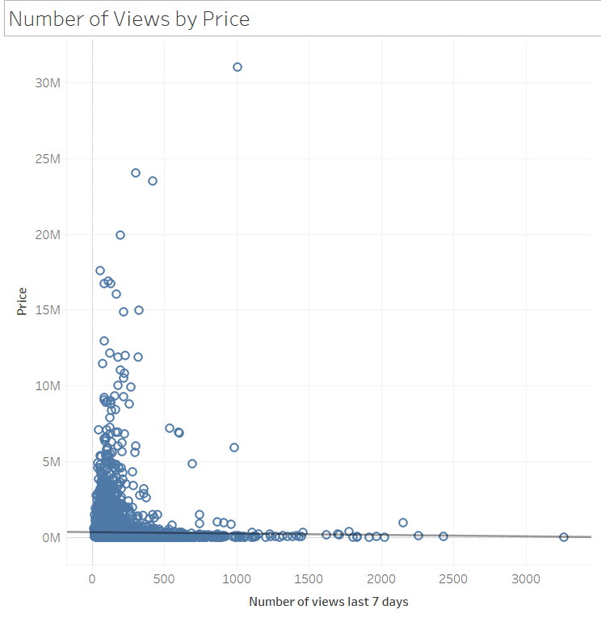
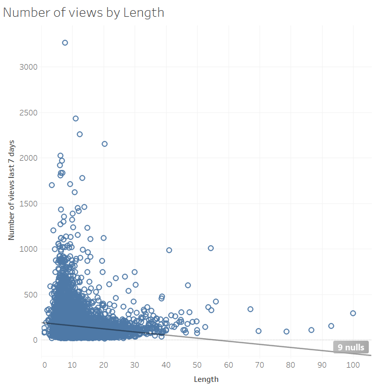
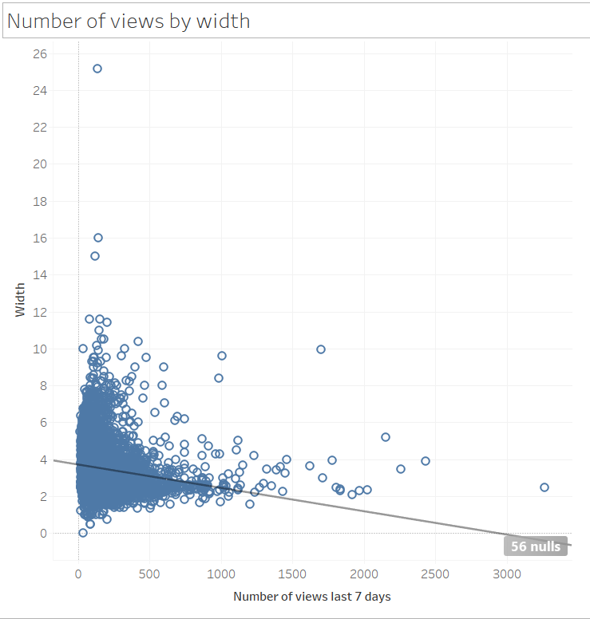
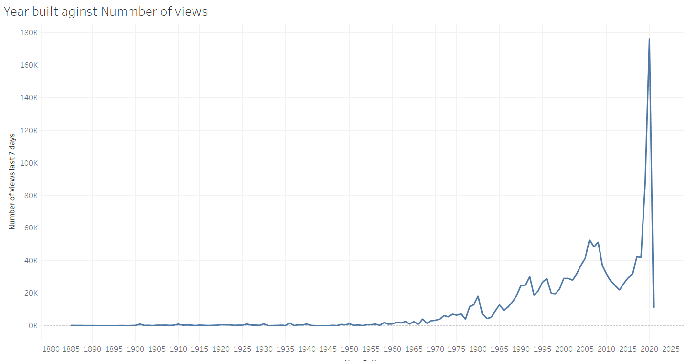
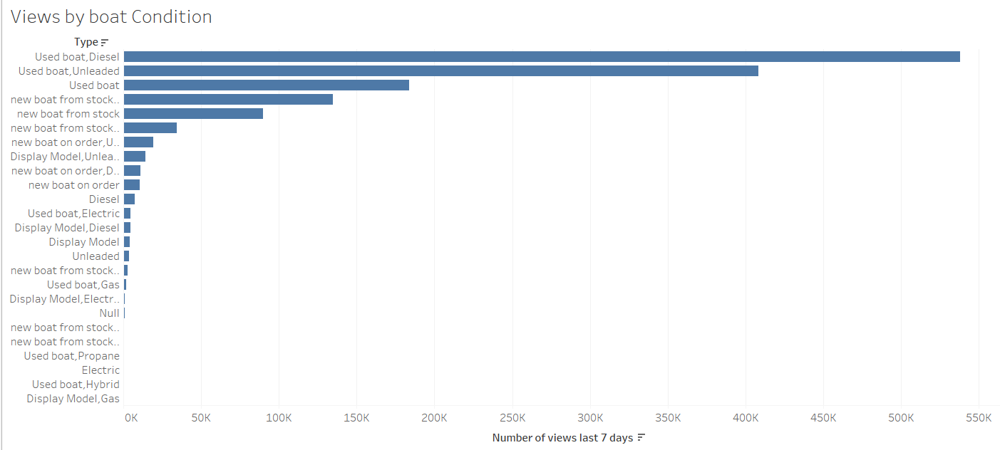
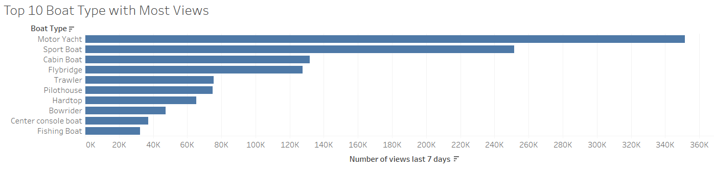
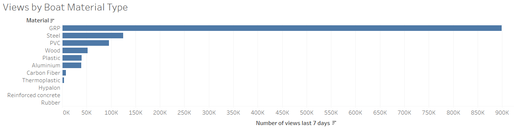
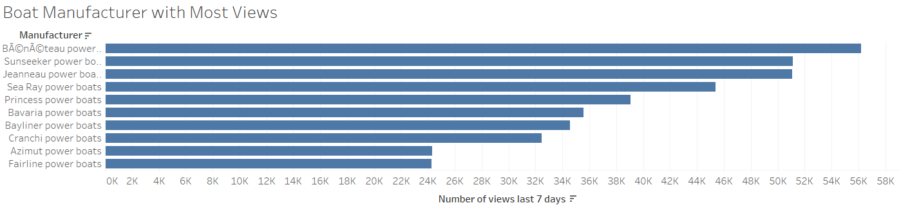
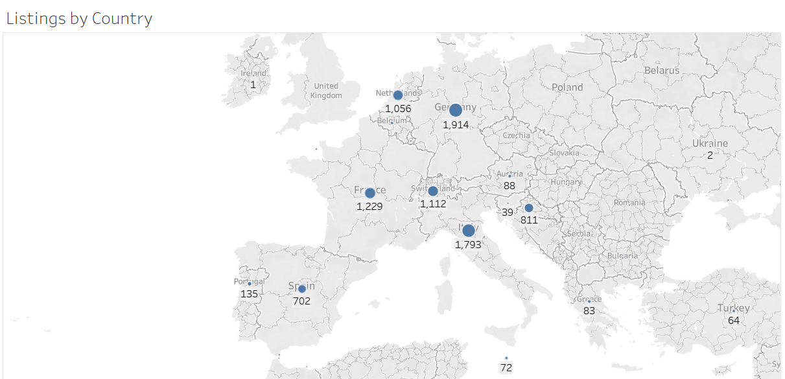

# Boat_Listings_Analysis_Tableau
Analysing dataset containing data of boat listings on a website.
## Business Problem
A website that allows users to advertise their used boats for sale prepares weekly newsletters for boat owners. The newsletter is designed
to help sellers to get more views of their boat, as well as stay on top of market trends. Using data of boat listings of their website, the website seeks to understand if there are common features among the most viewed boats.
## Data Understanding
The following variables are available in the dataset provided:
  * Price -  boat price listed in different currencies (e.g. EUR, £, CHF etc.) on the website
  * Boat Type - type of the boat
  * Manufacturer - manufacturer of the boat
  * Type - condition of the boat and engine type(e.g. Diesel, Unleaded, etc.)
  * Year Built = year of the boat built
  * Length - length in meter of the boat
  * Width - width in meter of the boat
  * Material - material of the boat (e.g. GRP, PVC, etc.)
  * Location - location of the boat is listed
  * Number of views last 7 days - number of the views of the list last 7 days
## Findings
An exploratory data analysis was carried out to understand the distribution of variables and how they might influence the number of views a boat receives. 
### Number of views by Price, Length and Width
|       Price                      |          Length                       |        Width                 | 
|:--------------------------------:|:-----------------------------------:  | :----------------------------| 
|                    |                        |                | 
### Views by Built Year
   

### Views by Boat Condition
   

### Views by Boat Type
   

### Views by Boat Material Type
   

### Views by Boat Manufacturer
   

### Countries with the most listings
   

## Overview of findings
  * Views of a boat are not driven by price
  * Most Boats are Listed in Europe
  * The main factors that drive views are: built year, boat material, and boat condition.

